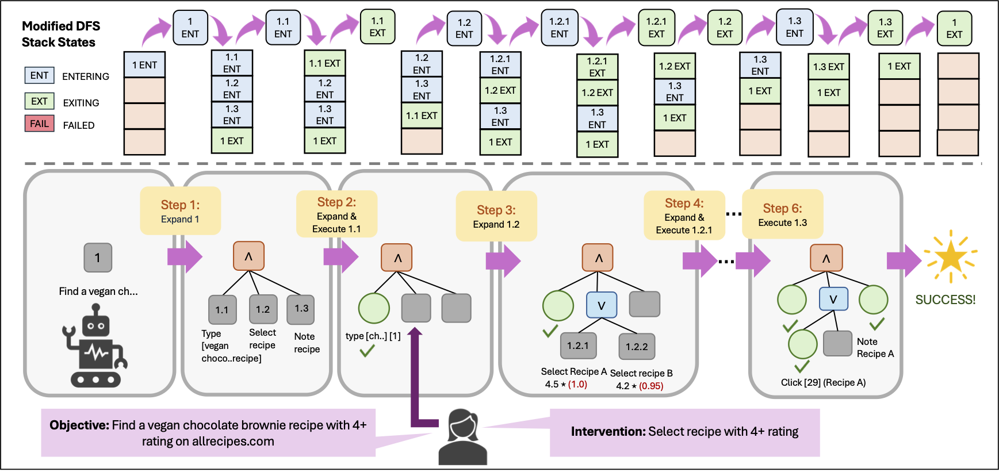
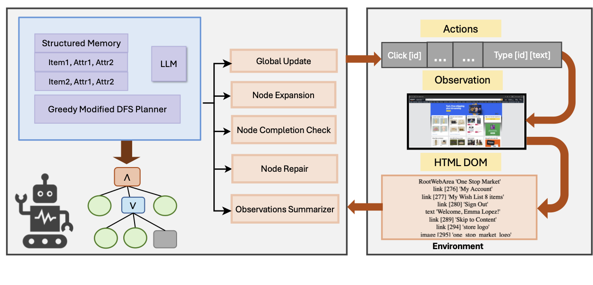
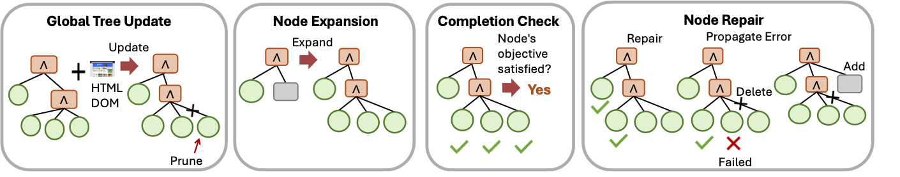
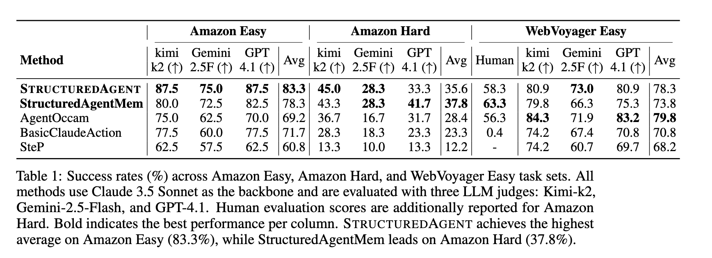
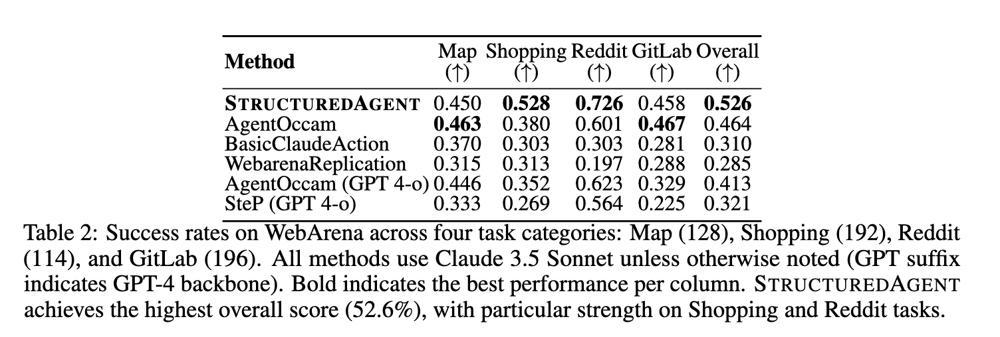
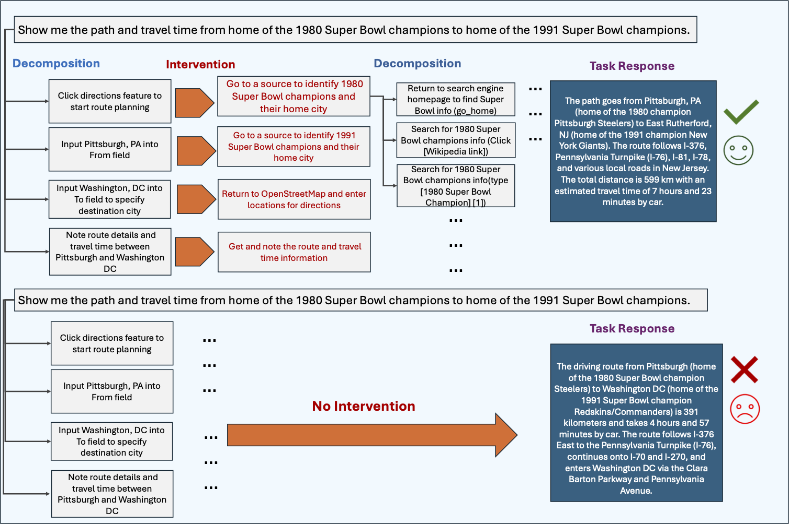

# From Human Problem-Solving to Hierarchical Planning-Based Web Agents

## Motivation

Imagine you need to find three ergonomic office chairs priced under $400, each from a distinct brand, with specific lumbar support and adjustable armrest requirements. You would probably start with a broad search, scan a few results, filter by price, compare options across multiple tabs, backtrack when something does not fit, and gradually narrow down until all three slots are filled. The whole process is fluid, structured, and remarkably robust to dead ends.

Now give the same task to a state-of-the-art LLM-based web agent. It will likely find one chair, maybe two, then either declare the task complete or give up. Not because it cannot read a product page, but because it lacks any mechanism for tracking what it has already found, verifying that all constraints are satisfied, or recovering when a search branch fails.

This gap is the problem StructuredAgent is designed to close.

In 1972, Newell and Simon characterized human problem-solving as heuristic search coupled with means-ends analysis. They described complex tasks as recursively decomposed into subproblems, with alternative strategies held in parallel and failures met with backtracking rather than abandonment. That characterization offers a precise diagnosis of what current web agents are missing. The rest of this post explains what we built to address it.

<video width="100%" controls>
  <source src="Amazon_Video_effects_wt_3.mp4" type="video/mp4">
</video>

## Why Current Web Agents Fail

Most failures in existing web agents trace back to four specific limitations, each corresponding to a cognitive capability that humans exercise naturally.

**Flat reasoning without hierarchical decomposition.** Humans organize complex tasks into structured hierarchies. We break goals into subgoals, track progress at each level, explore alternatives when needed, and backtrack when a path closes off. Current agents struggle on both fronts. They generate shallow, poorly structured decompositions and cannot reliably follow multi-level plans over long horizons. As tasks extend across dozens of steps, agents lose track of subgoal completion, fail to backtrack when branches fail, and lack the structured memory to maintain coherence across the whole plan.

**Memorylessness across browsing steps.** A single web page can exceed twenty thousand tokens of HTML. Most agents operate on only the current page and a compressed action history, which means a promising product encountered five pages earlier is effectively lost. Humans maintain a running mental inventory of alternatives throughout a search.

**Silent failure without recovery.** When a strategy fails, humans naturally step back and try a different approach. A filter that returns no results, a page that loads incorrectly, a product that is out of stock: each of these prompts a human to adapt. Most agents either retry the same failed action or abandon the task entirely after a few unsuccessful attempts.

**Greedy termination without constraint verification.** When a task requires satisfying multiple constraints simultaneously, agents tend to declare success upon finding any candidate, without checking that all user-specified requirements are met. This produces partial or incorrect results, particularly on tasks with several concurrent conditions.

*AgentOccam vs StructuredAgent on a Pinterest task: AgentOccam terminates its search prematurely when it fails to explore the third trend. StructuredAgent successfully retrieves items for all three trending women's ethnic wear styles.*

## AND/OR Trees: A Classical Formalism Revisited

Newell and Simon's framework inspired a formal representation in AI known as AND/OR trees. The structure consists of three node types.

**AND nodes** represent conjunctive subgoals. All children must succeed for the parent to succeed. Completing a shopping task, for instance, requires searching for products, evaluating candidates, and recording the final selection.

**OR nodes** represent alternative strategies. The parent succeeds as soon as any child succeeds. When evaluating candidates, the agent might try filtering by price, browsing a category page, or refining the search query.

**ACTION nodes** are leaf nodes corresponding to concrete browser operations such as typing a query, clicking a link, scrolling, or navigating back.

This formalism captures hierarchical decomposition with built-in fallback reasoning. Researchers studied it extensively in classical AI, but confined its use to clean, fully observable domains such as theorem proving and game playing. Dynamically constructing such trees for the partially observable, stochastic, and high-dimensional environment of real web browsing is a substantially harder problem.

*Figure 3: An AND/OR tree for a representative web shopping task.*

## StructuredAgent

Large language models make AND/OR trees viable for web tasks today. LLMs excel as local decision-makers: they interpret raw HTML, generate plausible subgoals, and evaluate whether an objective has been met. What they cannot do reliably is manage the global structure of a plan spanning dozens of steps.

StructuredAgent exploits this asymmetry through a clear separation of responsibilities. The framework manages the tree, handling construction, traversal, backtracking, and pruning. The LLM handles only well-scoped local operations: expanding a node into subgoals, selecting an action, checking whether an objective was achieved, or repairing a failed subtree. No single LLM call needs to reason about the entire plan.

*Figure 4: StructuredAgent architecture overview.*

### Dynamic Tree Construction and Traversal

The agent constructs its AND/OR tree online during task execution using a modified depth-first search. Each node on the search stack carries one of three execution states.

In the **Entering** state, the node has not yet been processed. The agent invokes the LLM to determine its type and generate children. In the **Exiting** state, the node's children have been processed and the agent evaluates whether the node's objective has been satisfied. In the **Failed** state, execution or completion checking has failed, the agent attempts repair and, if unsuccessful, prunes the node and propagates failure upward.

Unlike standard depth-first search, nodes may be revisited multiple times as the tree evolves through pruning and revision. Six status values track this lifecycle: Unvisited, Visited, Success, Fail, Pruned, and Deleted.

*Illustration of node state transitions during iterative modified greedy depth-first search on an AND/OR tree. Unlike traditional depth-first search, nodes may be revisited and repeatedly transition through Entering, Exiting, and Failed states.*

### Failure Propagation and Recovery

Failure handling is central to the framework's robustness. When an ACTION node fails, the framework prunes it. If the node belongs to an AND node, the framework deletes the remaining unexecuted siblings, since the conjunctive requirement can no longer be met, and propagates failure to the parent. The parent then attempts repair by generating new subgoals within a revision budget. If repair is exhausted, the framework prunes the entire subtree and continues propagating failure upward.

For OR nodes, the agent first checks for remaining untried alternatives. If alternatives exist, it selects the next most promising child. Otherwise, it attempts repair or prunes the node.

This mechanism ensures the agent systematically explores the search space before concluding a task cannot be completed, in contrast to baseline agents that terminate at the first point of failure.

### Five Core Operations

*Overview of the primary operations used to construct and maintain the AND/OR tree structure.*

The tree is maintained through five operations, each implemented as a scoped LLM call.

**Node Expansion** determines node type and generates children, whether subgoals, alternative strategies, or browser actions. **Node Repair** revises failed nodes by proposing new children or recommending pruning. **Global Tree Update** prunes irrelevant branches and refines node descriptions as new information is acquired. **Node Completion Check** evaluates whether a node's objective has been achieved given its children's outcomes. The **Observation Summarizer** condenses raw HTML into task-relevant summaries that fit within the LLM's context budget.

### Structured Memory

For information-seeking tasks that require identifying items satisfying multiple constraints, StructuredAgent includes a Structured Memory module. Rather than maintaining unstructured notes, which are prone to information loss and misinterpretation, the module organizes candidate entities in a dynamic table. Each row represents a candidate item and columns track individual constraints and their satisfaction status. The schema accommodates new constraints as the agent encounters them during exploration.

During planning, the module retrieves the top-K candidates satisfying the most constraints to guide subsequent actions, reducing redundant exploration and improving constraint satisfaction across the full task.

*Example of Structured Memory used to track candidate solutions during information-seeking tasks.*

## Experimental Results

We evaluate StructuredAgent on three benchmarks: a custom set of sixty complex Amazon shopping tasks ranging from 10 to 30 steps each, a curated subset of 129 WebVoyager tasks on live websites, and 630 WebArena tasks across shopping, maps, Reddit, and GitLab. All main experiments use Claude 3.5 Sonnet as the backbone LLM.

On shopping tasks, StructuredAgent achieves 83.3% on easy tasks, compared to 69.2% for AgentOccam, and 37.8% on hard tasks with Structured Memory, compared to 28.4%. Under human evaluation, the hard-task gap is 63.3% versus 56.3%.

On WebArena, StructuredAgent achieves 52.6% overall, outperforming AgentOccam by 6 points and simpler baselines by over 20 points, with the largest gains on Shopping and Reddit tasks.

With Claude 3.7 Sonnet, a model explicitly trained for agentic tasks, StructuredAgent still outperforms AgentOccam by 7.8 points. This demonstrates that hierarchical planning adds value beyond what the base model alone provides. Evaluation with Kimi-K2 as the backbone confirms that these benefits generalize across model families.

The most illustrative result is qualitative. On a complex Pinterest task requiring three trending fashion styles with matching accessories from verified sellers, StructuredAgent retrieves all three trends with complete, color-coordinated results. The strongest baseline completes two trends and explicitly terminates with failure on the third. The AND node structure prevents premature termination: the agent continues until all required branches succeed or all alternatives are exhausted.

*Results on WebVoyager*

*Results on WebArena*

## Interpretability and Human Oversight

The AND/OR tree representation offers a practical benefit beyond performance: interpretability. The tree serves as a readable artifact that transparently reflects the agent's reasoning and enables precise error localization. When a subgoal is incorrectly decomposed, a human operator can inspect the tree, identify the error, and inject corrective subgoals at the appropriate level. The agent then resumes execution from the corrected plan. This form of targeted human-in-the-loop oversight is simply not feasible with flat agent trajectories.

*Human Decomposition Intervention in AND/OR Tree Planning. When the agent incorrectly decomposes a task, here finding the driving route between the home cities of the 1980 and 1991 Super Bowl champions, it defaults to unverified assumptions, hallucinating Pittsburgh, PA and Washington, DC as destinations. A human operator intercepts the flawed plan and injects three corrective subgoals into the AND/OR tree: identify the 1980 champion and their home city, identify the 1991 champion and their home city, and resume navigation with the verified locations. This yields the correct route from Pittsburgh, PA to East Rutherford, NJ, at 599 km and approximately 7 hours 23 minutes. Human interventions of this kind can be applied at any level of the tree, catching and correcting errors in subgoal formulation wherever they arise.*

## Conclusion

StructuredAgent addresses the core limitations of current web agents by reintroducing hierarchical planning through AND/OR trees, a formalism that directly mirrors the decomposition, backtracking, and constraint-tracking strategies that characterize human problem-solving. The framework separates global planning from local decision-making and assigns each to the component best suited for it: tree management to the framework and page-level reasoning to the LLM.

The result is consistent improvement across multiple benchmarks and model families, with the largest gains concentrated precisely where current agents struggle most: long-horizon, multi-constraint tasks that demand sustained, structured reasoning from start to finish. As web tasks grow more complex and consequential, structured planning of this kind will become a necessary component of any reliable agent architecture.